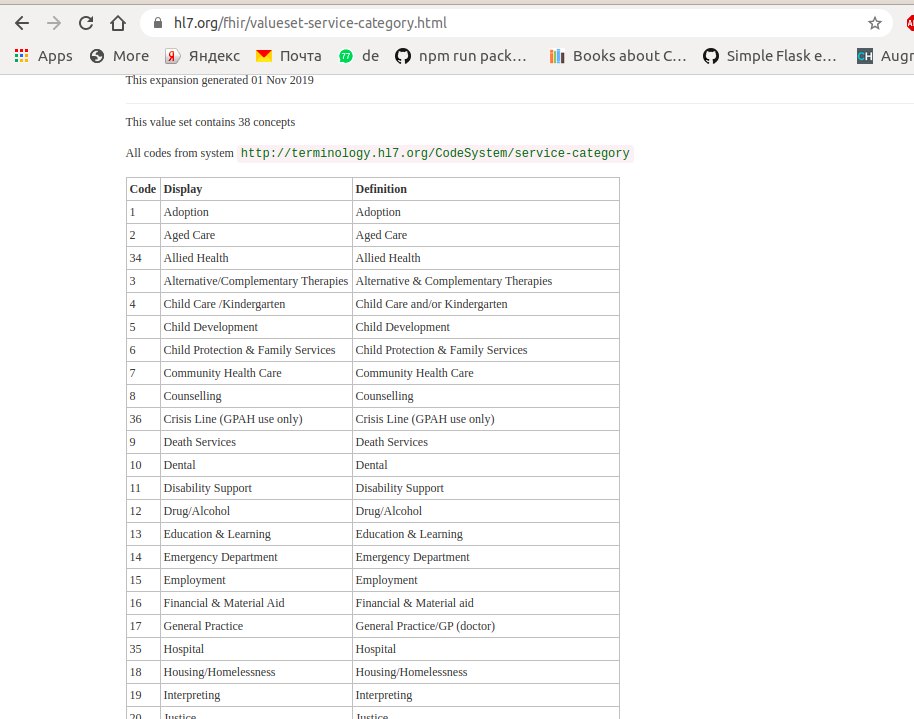
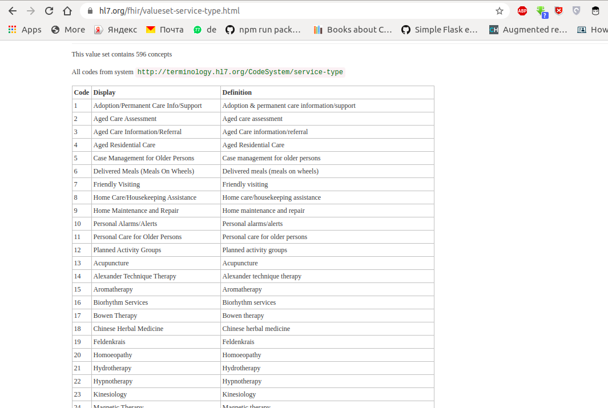

# fhir-scraper
A scrapping tool built in python to scrape FHIR health-care service categories

> My company needed to scrape categories and types on [FHIR](https://www.hl7.org/fhir) for a health application
> so i built a very simple scrapping tool to achieve that.
> we realized value services and types of resources on FHIR had the same format and page style (including tags) if you observe



>
>



> To make this tool a bit user-friendly, i decided to add command-line argument

## What this tool does?
* accept link and file path provided as command-line arguments
* scrape code,Display and definition in page of provided link 
* store results in a csv file using pandas


## Install and Run

1. Get the source code on to your machine via git.

    ```shell
    git clone https://github.com/ElijahAhianyo/fhir-scraper.git && cd fhir-scraper
    ```

2. create virtualenv (python 3) and install dependencies

    ```shell
        python -m venv .virtualenv
        pip install -r requirements.py
    ```

3. Run Application 

    ```shell
        python app.py --help
    ```


## Demo


